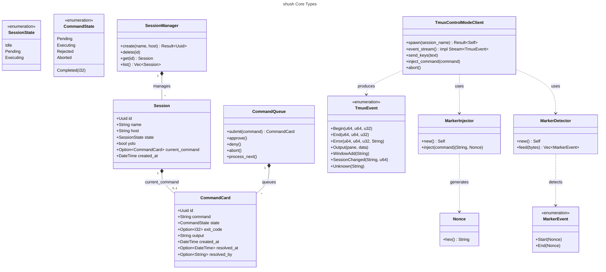
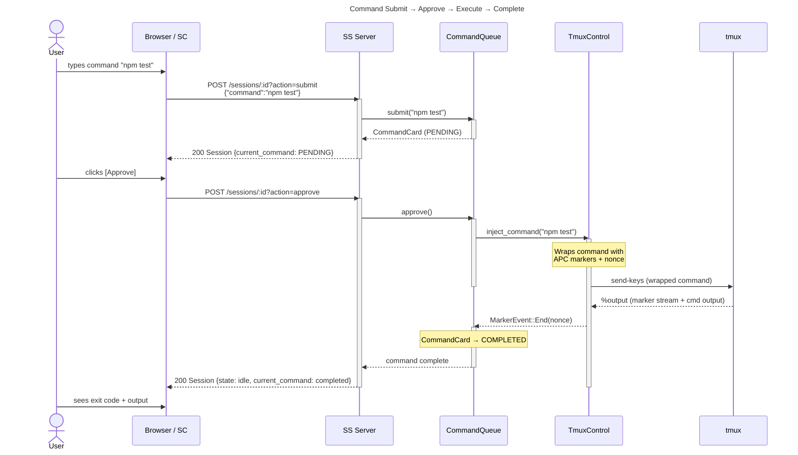
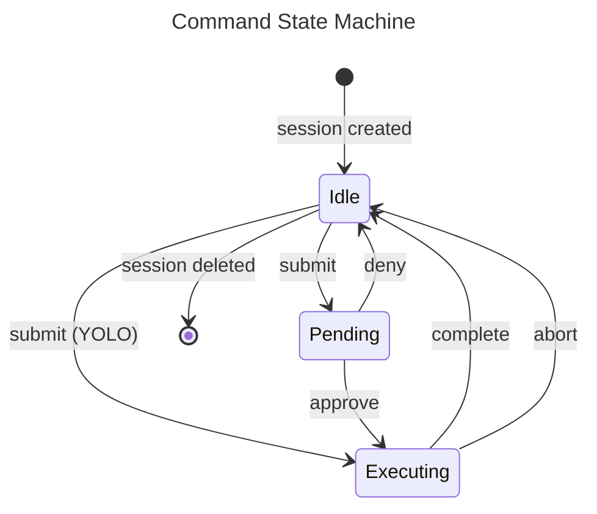
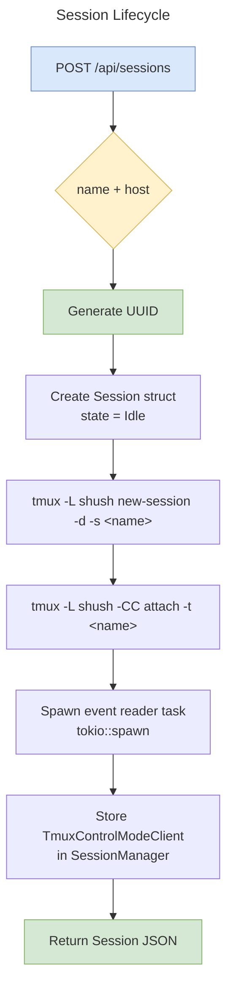

# shush v0.1 — Architectural Diagrams

## 1. Class Diagram — Core Data Model

---

## 2. Sequence Diagram — Command Execution Flow

---

## 3. Flowchart — Command Lifecycle State Machine

---

## 4. Flowchart — Session Lifecycle

