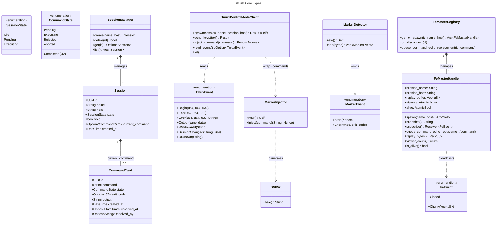
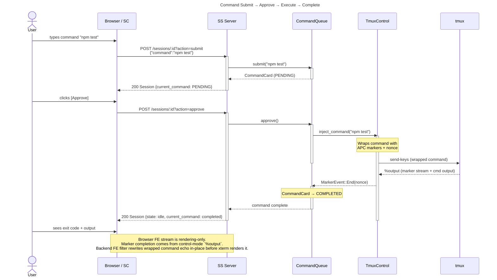
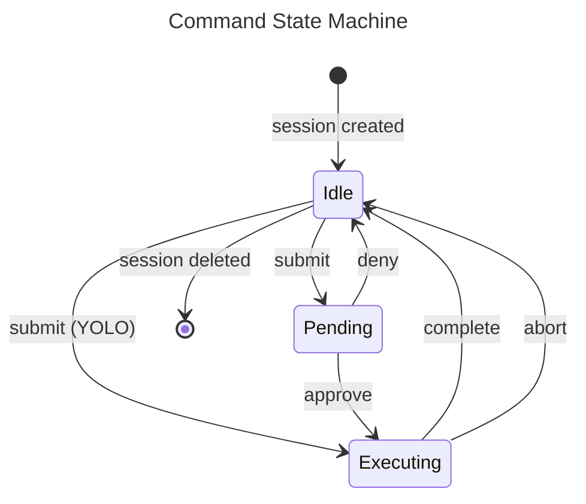
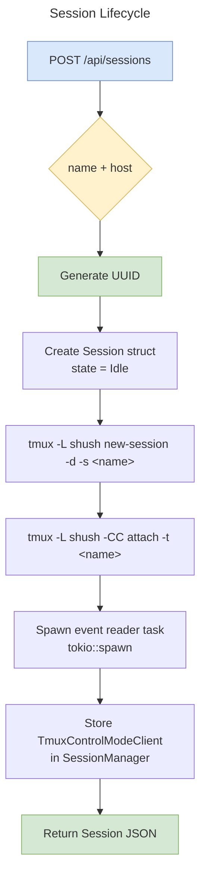
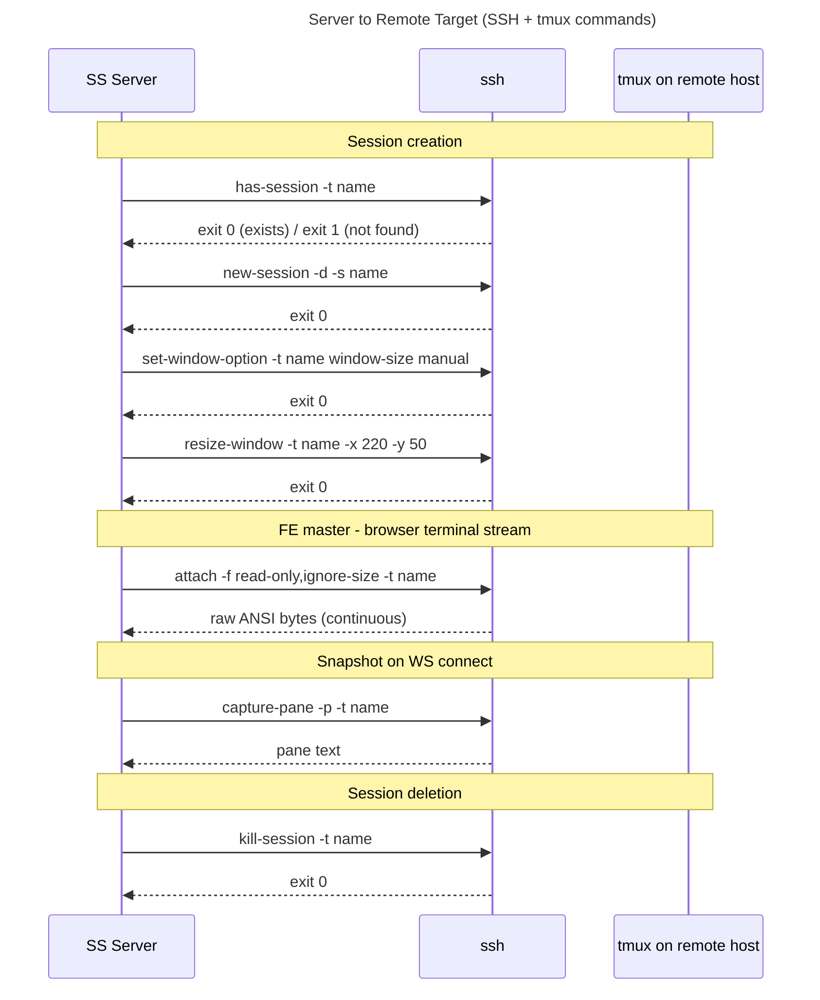
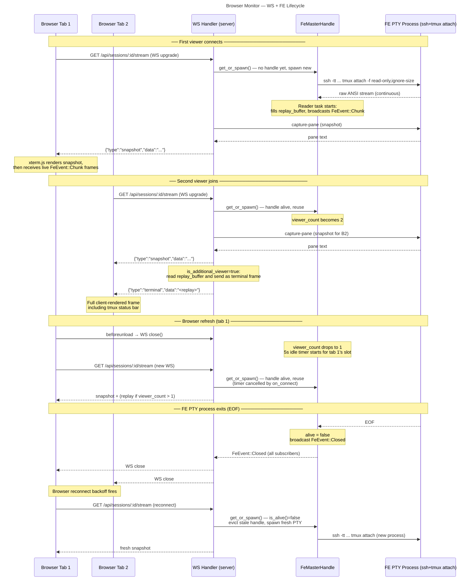

# shush v0.1 — Architectural Diagrams

## 1. Class Diagram — Core Data Model

---

## 2. Sequence Diagram — Command Execution Flow

---

## 3. Flowchart — Command Lifecycle State Machine

---

## 4. Flowchart — Session Lifecycle

---

## 5. Sequence Diagram — Server ↔ Remote Target Interactions

Covers every SSH/tmux command the shush server issues against a remote host, the flags used, and what each does.

All one-shot commands use `ssh -o BatchMode=yes [-F config] host tmux -L shush ...`.
The FE master attach uses `ssh -o BatchMode=yes -tt [-F config] host tmux -L shush ...`.

### SSH flags

| Flag | Where used | Purpose |
|---|---|---|
| `-o BatchMode=yes` | all commands | Fail immediately if key auth unavailable — never prompt. The server has no TTY so any SSH prompt would hang forever. |
| `-F config` | all commands | Optional path to SSH config file (from `SHUSH_SSH_CONFIG` env var). Sets host alias, identity file, port, etc. |
| `-tt` | FE master attach only | Force PTY allocation on the remote side. `tmux attach` calls `tcgetattr()` on startup and exits with `ENOTTY` if it has no controlling terminal. |

### tmux flags

| Command / flag | Where used | Purpose |
|---|---|---|
| `-L shush` | all commands | Use a named tmux socket (`shush`) instead of the default. Isolates shush-managed sessions from the user's own tmux. |
| `new-session -d -s name` | session creation | Create a detached (`-d`) session with a given name (`-s`). Detached means no terminal is needed for creation. |
| `set-window-option window-size manual` | session creation | Disable tmux's automatic pane resize when clients attach/detach. Without this, an external SSH attach at a different terminal size resizes the pane and corrupts the browser view. |
| `resize-window -x 220 -y 50` | session creation | Lock the window to exactly the same dimensions xterm.js initialises to. Combined with `window-size manual`, geometry stays stable regardless of external clients. |
| `attach -f read-only,ignore-size` | FE master | `read-only` prevents the FE client from sending keystrokes. `ignore-size` excludes this client from window size negotiation so external attaches cannot resize the pane. |
| `capture-pane -p` | WS connect | Dump the current pane content as plain text to stdout (`-p`). Used as the initial snapshot. Note: omits the tmux status bar; the replay buffer is sent immediately after for additional viewers to restore the full frame. |
| `kill-session -t name` | session deletion | Terminate the named session and all its windows/panes. |

---

## 6. Sequence Diagram — Browser Monitor Lifecycle

Shows how the browser WebSocket interacts with the server's FE master handle across connect, multi-tab, refresh, and EOF recovery scenarios.

